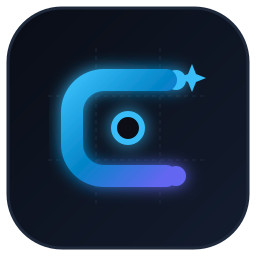
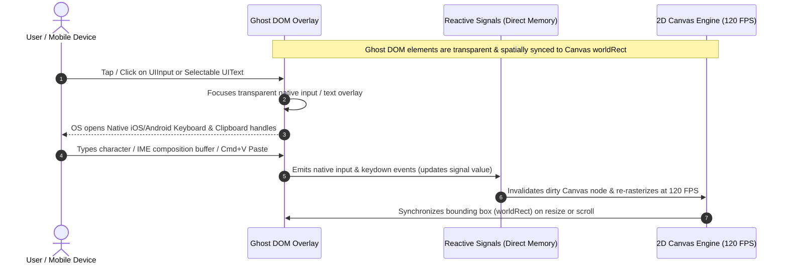

# CanvApps 🎨

<p align="center">
  
</p>

<p align="center">
  <strong>The First Compiled UI Framework That Renders at 120 FPS by Eliminating the DOM.</strong><br>
  <em>Svelte-like compiled syntax. Native 120 FPS hardware rasterization. Zero DOM layout thrashing.</em>
</p>

<p align="center">
  <a href="https://www.npmjs.com/package/@canvapps/core"></a>
  <a href="https://www.npmjs.com/package/@canvapps/core"></a>
  <a href="LICENSE"></a>
  <a href="https://www.typescriptlang.org/"></a>
  <a href="https://vitejs.dev/"></a>
  <a href="https://capacitorjs.com/"></a>
  
  
</p>

---

## 🌟 The Paradigm Shift: Why CanvApps?

> **CanvApps is not a canvas drawing library; it is a full-featured compiled UI application framework.**
>
> Historically, building web interfaces forced developers to choose between two painful trade-offs:
> 1. **DOM-Based Frameworks (React, Vue, Angular):** Ergonomic to write, but bound to the browser's heavy DOM synchronization, involuntary layout thrashing (reflows), Virtual DOM diffing overhead, and frame drops under high data density.
> 2. **Canvas / WebGL Solutions (Flutter Web, low-level graphics engines):** Extremely fast rasterization, but fundamentally broken as a "black box": no native mobile virtual keyboards, broken text selection and clipboard operations, zero accessibility for screen readers, and massive initial bundle sizes.
>
> **CanvApps solves this dilemma permanently:** it compiles declarative Single-File Components (`.cvs`) with Svelte-like syntax directly into an HTML5 2D GPU-accelerated Canvas render tree running deterministically at 120 FPS, backed by the groundbreaking **Ghost DOM** architecture for 100% native text editing, mobile virtual keyboards, and accessibility.

```text
┌───────────────────────────────────────────────────────────────────────────────────┐
│                                CANVAPPS ARCHITECTURE                              │
├─────────────────────────────────────────┬─────────────────────────────────────────┤
│          🎨 2D GPU CANVAS LAYER         │           👻 GHOST DOM LAYER            │
│   (120 FPS Hardware Rasterization)      │   (Zero-Cost Semantic HTML Overlay)     │
├─────────────────────────────────────────┼─────────────────────────────────────────┤
│ • Pure Mathematical Flexbox (No reflow) │ • Native iOS/Android Virtual Keyboards  │
│ • Fine-Grained Signals (No VDOM diff)   │ • Real Browser Text Selection & Copy    │
│ • Hardware-timed Kinetic & Motion FX    │ • Full A11y (VoiceOver / TalkBack / ARIA│
│ • Direct Pixel-Perfect DPR Retina Scale │ • OS Context Menus & IME Compositions   │
└─────────────────────────────────────────┴─────────────────────────────────────────┘
```

---

## ⚡ Key Features at a Glance

* 🚀 **120 FPS Native Hardware Rendering:** Renders directly to an HTML5 2D Canvas with sub-pixel precision and automatic Retina / high-DPI scaling.
* 🚫 **Zero DOM Overhead & Zero Layout Thrashing:** All layouts are calculated mathematically in pure TypeScript using a standalone, W3C-compliant Flexbox solver in microseconds.
* 👻 **Ghost DOM Technology:** Eliminates the historical canvas bottleneck by projecting transparent, semantically accurate HTML nodes for **native mobile keyboards (iOS/Android)**, real text selection, system clipboard (`Cmd+C`/`Ctrl+C`), and screen readers (VoiceOver, TalkBack).
* ⚡ **Fine-Grained Signals Reactivity:** Direct memory state primitives (`signal`, `computed`, `effect`, `batch`) that trigger surgical Canvas node repaints with **zero Virtual DOM diffing**.
* 🎨 **Declarative `.cvs` Single-File Components:** Svelte-like developer experience with `<script lang="ts">`, `@each` list iteration, `@if` conditionals, `:prop` dynamic bindings, and instant Vite Hot Module Replacement (HMR).
* 🎞️ **Hardware Motion & Kinetic Physics:** Declarative `<motion>` presets, Figma-grade Hero shared-element morph modals, and `KineticFX` parabolic flight tokens with particle bursts.
* 📦 **Multi-Target Automation:** Build for **SPA**, **PWA** (with automated Service Worker & Web Manifest generation), or **Native Mobile (iOS & Android)** via Capacitor from a single `canvapps.config.ts`.
* 🛠️ **Dedicated IDE Extension:** First-class syntax highlighting, code snippets, and `Cmd+Click` / `Ctrl+Click` definition navigation for VS Code, Cursor, and Antigravity IDE.

---

## 👻 The Ghost DOM: Solving Text, Inputs & Accessibility on Canvas

For senior engineers and architects evaluating canvas-based frameworks, the immediate question is always: **"How do you handle text editing, mobile virtual keyboards, clipboard, and accessibility without the DOM?"**

In traditional canvas implementations (and early Flutter Web builds), canvas text is merely rasterized pixels. This causes critical usability failures:
1. Mobile devices (iOS & Android) **cannot invoke the virtual keyboard** on canvas taps because the operating system requires an active, focused HTML input element.
2. Users **cannot highlight or copy text** with native OS handles, right-click context menus ("Copy", "Share", "Look Up"), or standard shortcuts (`Cmd+C` / `Ctrl+C`).
3. International **IME composition** (Japanese, Chinese, Korean, accented characters) breaks completely.
4. Screen readers (Apple VoiceOver, Android TalkBack, NVDA) are completely blind to the UI.

### 🧠 How CanvApps Solves This: The Dual-Layer Ghost Architecture

CanvApps separates **visual rasterization** (handled by Canvas 2D at 120 FPS) from **semantic interaction** (handled by the Ghost DOM layer):



### 🔬 Technical Implementation Details

#### 1. Zero-Cost Spatial Synchronization
Inside [`GhostDOM.ts`](file:///Users/erickgiber/Documents/Repositories/CanvApps/CanvApps/ghost/GhostDOM.ts), CanvApps maintains a single absolute overlay container (`#canvapps-ghost-dom-overlay`) with `pointer-events: none` and zero border/padding overhead:
* Whenever an interactive node (`UIInput`, `UIText`, `UIButton`) is registered, a lightweight HTML counterpart (`<input>`, `<textarea>`, `<span class="canvapps-ghost-text">`) is generated with `opacity: 0` or transparent text fill.
* Every frame or layout update, `updatePosition(target)` synchronizes the exact spatial coordinates (`worldRect.x`, `worldRect.y`, `width`, `height`, `fontSize`, `lineHeight`, `fontFamily`) with sub-pixel precision.
* Because Ghost elements reside in an unconstrained overlay layer, **they cause zero layout thrashing or document reflows**.

#### 2. Native Mobile Keyboards, Autocomplete & Password Managers
When a user taps a Canvas `UIInput` or `<input>`:
* The Ghost DOM focuses the corresponding transparent HTML `<input>` element.
* The OS immediately displays the native virtual keyboard (supporting numerical, email, password, and standard layouts via `:inputType`).
* Native browser autofill, 1Password, iCloud Keychain, and system spellcheck work seamlessly out of the box.
* Input events, selection ranges (`selectionStart`, `selectionEnd`), and caret positions stream directly into reactive signals with zero input lag.

#### 3. Real Sub-Pixel Text Selection & OS Context Menus
For `<text selectable="true">` nodes, the Ghost DOM mounts an invisible `<span class="canvapps-ghost-text">` matching the computed multiline word wrap and typography.
* Users can click-and-drag across text lines or double-tap on mobile.
* The browser renders native selection highlights (`::selection` with customizable tint).
* Native right-click context menus ("Copy", "Select All", "Share", "Translate") function identically to native web pages.
* `Cmd+C` / `Ctrl+C` copies clean plaintext to the system clipboard automatically.

#### 4. 100% Web Accessibility (WCAG / ARIA / Screen Readers)
Screen readers (Apple VoiceOver, Android TalkBack, NVDA) traverse the Ghost DOM tree. Assistive technologies read accurate semantic roles, input values, placeholders, and dynamic text labels, providing full accessibility compliance without sacrificing 120 FPS Canvas rendering.

#### 5. Automatic Lifecycle & Orphan Pruning
When dynamic components unmount or list items are filtered (`@each`), `GhostDOM.prune(activeIds)` immediately garbage-collects and removes orphaned DOM nodes, guaranteeing that the Ghost DOM footprint never leaks memory or accumulates dead elements.

---

## 📊 Architectural Comparison

| Dimension | Standard DOM (React / Vue) | Flutter Web (CanvasKit) | CanvApps |
| :--- | :--- | :--- | :--- |
| **Rendering Engine** | Browser HTML/CSS DOM | WebGL / Skia (Wasm) | **HTML5 2D Canvas (Hardware-Accelerated)** |
| **Frame Rate** | 30–60 FPS (Reflow-bound) | 45–60 FPS (Heavy GC) | **60–120 FPS Deterministic** |
| **Layout Solver** | Browser C++ Layout (Slow reflows) | Skia/Dart Layout | **Pure TypeScript Mathematical Flexbox** |
| **Reactivity** | Virtual DOM Diffing / Proxies | Widget Rebuild Tree | **Fine-Grained Signals (Zero VDOM)** |
| **Component Format** | JSX / Vue SFC (Runtime overhead) | Nested Dart classes | **Compiled `.cvs` SFC (Svelte-like)** |
| **Mobile Keyboards** | Native | Emulated / Problematic | **Native OS Keyboards (via Ghost DOM)** |
| **Text Selection & A11y** | Native | Historically Emulated/Canvas | **Real Browser Selection & A11y (via Ghost DOM)** |
| **Bundle Size** | Medium to Heavy | Very Large (>2MB initial Wasm) | **Ultra-Lightweight (<30KB core)** |

---

## 📦 Installation

```bash
# Using npm
npm install @canvapps/core

# Using pnpm
pnpm add @canvapps/core

# Using yarn
yarn add @canvapps/core

# Using bun
bun add @canvapps/core
```

### CDN Direct `<script>` Tag (No Build Tools Required)

```html
<!DOCTYPE html>
<html>
<head>
  <style>
    html, body, #app { width: 100%; height: 100%; margin: 0; overflow: hidden; }
  </style>
</head>
<body>
  <div id="app"></div>
  <script src="https://cdn.jsdelivr.net/npm/@canvapps/core/dist/canvapps.umd.cjs"></script>
  <script>
    const { Engine, UIView, UIText, UIButton, signal, effect } = window.canvapps;

    const count = signal(0);
    const engine = new Engine({ container: '#app', autoResize: true, backgroundColor: '#0f172a' });

    const root = new UIView({ width: '100%', height: '100%', alignItems: 'center', justifyContent: 'center', gap: 14 });
    const text = new UIText('Clicks: 0', { fontSize: 22, color: '#ffffff' });
    const btn = new UIButton('+ Click Me', { padding: [10, 20], backgroundColor: '#2563eb', labelColor: '#ffffff' });

    btn.on('click', () => count.update(n => n + 1));
    effect(() => text.setText(`Clicks: ${count.value}`));

    root.addChild(text).addChild(btn);
    engine.setRoot(root).start();
  </script>
</body>
</html>
```

---

## 🚀 3-Minute Quickstart (TypeScript)

```ts
import { Engine, UIView, UIText, UIButton, UIInput, signal, effect } from '@canvapps/core';

// 1. Initialize the 120 FPS Canvas Engine
const engine = new Engine({
  container: '#app',
  backgroundColor: '#f8fafc',
  autoResize: true,
});

// 2. Define Direct Memory Reactive Signals
const cycleCount = signal(0);
const inputValue = signal('');

// 3. Construct the Mathematical Flexbox Tree
const root = new UIView({
  width: '100%',
  height: '100%',
  flexDirection: 'column',
  alignItems: 'center',
  justifyContent: 'center',
  padding: 24,
  gap: 16,
});

const counterText = new UIText('Cycles: 0', {
  fontSize: 20,
  fontWeight: 'bold',
  color: '#0f172a',
  selectable: true, // Ghost DOM text selection enabled
});

const incrementButton = new UIButton('+ Increment', {
  padding: [10, 20],
  backgroundColor: '#2563eb',
  hoverBackgroundColor: '#1d4ed8',
  borderRadius: 8,
});

incrementButton.on('click', () => {
  cycleCount.update((n) => n + 1);
});

// 4. Bind Signals Reactively (Zero VDOM Diffing)
effect(() => {
  counterText.setText(`Cycles: ${cycleCount.value}`);
});

// 5. Mount and Start the 120 FPS Loop
root.addChild(counterText).addChild(incrementButton);
engine.setRoot(root).start();
```

---

## 🎨 Declarative `.cvs` Single-File Components

CanvApps provides an intuitive Single-File Component format (`.cvs`) that compiles directly to imperative Canvas nodes during build time with **zero runtime compiler overhead**.

### Example Component (`src/App.cvs`)

```html
<script lang="ts">
  interface Task {
    id: number;
    title: string;
  }

  const tasks = signal<Task[]>([
    { id: 1, title: 'Eliminate DOM layout thrashing' },
    { id: 2, title: 'Test Ghost DOM on iOS & Android' },
    { id: 3, title: 'Render 10,000 nodes at 120 FPS' },
  ]);

  const taskInput = signal('');

  function onInput(e: any) {
    taskInput.value = e?.target?.value ?? e?.value ?? '';
  }

  function handleAddTask() {
    const text = taskInput.value.trim();
    if (!text) return;
    tasks.update((list) => [{ id: Date.now(), title: text }, ...list]);
    taskInput.value = ''; // Reactively clears the canvas input and ghost element
  }

  function removeTask(id: number) {
    tasks.update((list) => list.filter((t) => t.id !== id));
  }
</script>

<view width="100%" height="100%" flexDirection="column" backgroundColor="#f8fafc" padding="[20, 32]" gap="16">
  
  <!-- Header Bar -->
  <view width="100%" flexDirection="row" justifyContent="space-between" alignItems="center" padding="[14, 20]" backgroundColor="#ffffff" borderRadius="12" borderWidth="1" borderColor="#e2e8f0">
    <text fontSize="18" fontWeight="bold" color="#0f172a">🎨 CanvApps 120 FPS Studio</text>
    <view padding="[4, 10]" backgroundColor="#ecfdf5" borderRadius="8">
      <text fontSize="11" fontWeight="600" color="#047857">● 120 FPS Retina Active</text>
    </view>
  </view>

  <!-- Input Form (Synced with Native Mobile Keyboards via Ghost DOM) -->
  <view width="100%" flexDirection="row" gap="10">
    <input 
      placeholder="Type a new task and press Enter..." 
      flexGrow="1" 
      backgroundColor="#ffffff" 
      borderColor="#cbd5e1" 
      focusBorderColor="#2563eb"
      padding="[10, 14]" 
      :value="taskInput.value" 
      @input="onInput" 
      @submit="handleAddTask" 
    />
    <button 
      label="Add Task" 
      backgroundColor="#2563eb" 
      hoverBackgroundColor="#1d4ed8" 
      labelColor="#ffffff" 
      padding="[10, 20]" 
      @click="handleAddTask" 
    />
  </view>

  <!-- Svelte-Style Reactive List Iteration -->
  <view width="100%" flexDirection="column" gap="8" flexGrow="1">
    <view 
      @each="tasks.value as item, index" 
      width="100%" 
      backgroundColor="#ffffff" 
      borderRadius="8" 
      borderWidth="1" 
      borderColor="#e2e8f0" 
      padding="[10, 14]" 
      flexDirection="row" 
      alignItems="center" 
      justifyContent="space-between"
    >
      <text fontSize="13" color="#334155" selectable="true">• {{ item.title }}</text>
      <button 
        label="✕" 
        backgroundColor="#fee2e2" 
        hoverBackgroundColor="#fecaca" 
        labelColor="#dc2626" 
        width="28" 
        height="28" 
        borderRadius="14" 
        fontSize="12" 
        @click="() => removeTask(item.id)" 
      />
    </view>
  </view>

</view>
```

---

## 🌈 `.cvs` Template Syntax Guide

### 1. Dynamic Property Bindings (`:prop={expr}` or `:prop="expr"`)
Pass reactive signals or conditional expressions directly to layout properties:
```html
<view 
  :gap={isMobile.value ? 6 : 12} 
  :flexDirection={isMobile.value ? 'column' : 'row'} 
  :padding={isMobile.value ? [10, 12] : [18, 28]}
>
  <button :backgroundColor={isActive.value ? '#2563eb' : '#64748b'} label="Toggle" />
</view>
```

### 2. Conditional Block Rendering (`@if { ... } else { ... }`)
Conditionally render Canvas subtrees reactively without boilerplate:
```html
@if (isMobile.value) {
  <text fontSize="12" color="#64748b">📱 Mobile Layout Active</text>
} else {
  <text fontSize="16" color="#0f172a">💻 Desktop 120 FPS Retina Layout</text>
}
```
*Also supports inline directives (`<view @if="isMobile.value">`).*

### 3. Reactive List Iteration Blocks (`@each`)
Iterate signals with sub-millisecond updates directly as blocks:
```html
@each tasks.value as item, index {
  <view width="100%" flexDirection="row" justifyContent="space-between" padding="12">
    <text fontSize="13" selectable="true">• {{ item.title }}</text>
    <button label="✕" @click="() => removeTask(item.id)" />
  </view>
}
```
*Also supports inline directives (`<view @each="tasks.value as item">`).*

### 4. Custom Component Composition
Import any `.cvs` component in `<script lang="ts">` and invoke it directly in templates using standard PascalCase tags:
```html
<script lang="ts">
  import SplashView from './views/SplashView.cvs';
  import DashboardView from './views/DashboardView.cvs';

  const showSplash = signal(true);
</script>

<view width="100%" height="100%">
  @if (showSplash.value) {
    <SplashView @finish="() => showSplash.value = false" />
  } else {
    <DashboardView />
  }
</view>
```

### 5. Persistent Master Layouts (`AppLayout.cvs`) & Reusable Slots
```html
<!-- src/layouts/AppLayout.cvs -->
<script lang="ts">
  import AppHeader from '../components/AppHeader.cvs';

  function onNavigate(target: string) {
    props.onNavigate?.(target);
  }
</script>

<view width="100%" height="100%" flexDirection="column" backgroundColor="#f8fafc" padding="[16, 24]" gap="14">
  <AppHeader :activeRoute="props.activeRoute" @navigate="onNavigate" />
  <view width="100%" flexGrow="1" position="relative">
    <slot />
  </view>
</view>
```

### 6. Fine-Grained Reactive Router (`createRouter`, `useRouter`)
```ts
<script lang="ts">
  import { createRouter } from '@canvapps/core';
  import HomeView from './views/HomeView.cvs';
  import SettingsView from './views/SettingsView.cvs';

  const router = createRouter({
    initialRoute: '/home',
    routes: [
      { path: '/home', component: HomeView },
      { path: '/settings', component: SettingsView },
    ],
  });
</script>

<view width="100%" height="100%">
  @if (router.currentPath.value === '/home') {
    <HomeView />
  }
  @if (router.currentPath.value === '/settings') {
    <SettingsView />
  }
</view>
```

---

## 🎞️ Hardware Motion & Animation Engine

CanvApps includes a first-class, hardware-timed 60/120 FPS declarative animation engine built directly into the Canvas rendering loop.

### 1. Declarative `<motion>` Component
```html
<!-- Cinematic Multi-Phase Splash Screen with Sub-pixel Kerning & Convergence -->
<motion 
  animation="cinematic-splash" 
  :duration="1100" 
  :hold="800" 
  :exitDuration="450" 
  :initialSpacing="26"
  @finish="onSplashFinish"
>
  <view width="100%" height="100%" backgroundColor="#090d16" flexDirection="column" alignItems="center" justifyContent="center">
    <text fontSize="56" fontWeight="bold" color="#ffffff">CanvApps</text>
    <text fontSize="14" color="#94a3b8">Hardware-Timed Canvas Engine</text>
  </view>
</motion>

<!-- Smooth Scene Entrance & Directional Exit Transitions -->
<motion enter="elastic" exit="slide-left" :duration="450" :exitDuration="320">
  <view width="100%" height="100%" flexDirection="column" backgroundColor="#f8fafc">
    <DashboardContent />
  </view>
</motion>
```

### 2. Kinetic Flight Tokens & Particle Bursts (`KineticFX`)
```ts
import { KineticFX } from '@canvapps/core';

// 1. Launch a Parabolic Flying Token to Target Element
KineticFX.flyToken({
  from: { x: clickEvent.clientX, y: clickEvent.clientY },
  to: '#counter-badge',
  text: '+100 XP',
  color: '#2563eb',
  backgroundColor: '#dbeafe',
  borderColor: '#93c5fd',
  duration: 480,
  arcHeight: 65,
  onHit: () => {
    streakScore.value += 100;
  },
});

// 2. Radial Particle Burst with Shockwave
KineticFX.burst({
  x: clickEvent.clientX,
  y: clickEvent.clientY,
  colors: ['#38bdf8', '#34d399', '#818cf8', '#f43f5e'],
  count: 24,
  radius: 60,
});
```

### 3. Modal Dialogs & Hero Morph Transitions (`<modal>`)
```html
<modal 
  :open="isModalOpen.value" 
  :originRect="originRect.value" 
  animation="hero" 
  :duration="340" 
  :blur="true"
  :blurRadius="12"
  backdropColor="rgba(0, 0, 0, 0.85)"
  @close="closeModal"
>
  <view width="760" backgroundColor="#ffffff" borderRadius="20" padding="28" flexDirection="column" gap="18">
    <text fontSize="20" fontWeight="bold" color="#0f172a">Hero Expanded Dialog</text>
    <text fontSize="14" color="#64748b">
      Smoothly expanded from thumbnail bounding box directly into full dialog with zero DOM lag.
    </text>
  </view>
</modal>
```

---

## 💾 Global Reactive Stores (`createStore`, `persistentSignal`)

```ts
// src/stores/session.store.ts
import { createStore, computed, persistentSignal } from '@canvapps/core';

export interface UserSession {
  user: { name: string; email: string; avatar: string } | null;
  isAuthenticated: boolean;
  theme: 'light' | 'dark';
}

// Global Store with Automatic localStorage Tab Sync
export const sessionStore = createStore<UserSession>({
  user: null,
  isAuthenticated: false,
  theme: 'light',
}, {
  name: 'session',
  persist: true,
});

export const isUserLoggedIn = computed(() => sessionStore.state.isAuthenticated);

export const authToken = persistentSignal('jwt_token', '');
```

---

## ⚙️ Multi-Target Builds (`canvapps.config.ts`)

```ts
import { defineConfig } from '@canvapps/core';

export default defineConfig({
  // Target: 'SPA' | 'PWA' | 'CAPACITOR'
  target: 'PWA',
  title: 'CanvApps Production App',
  outDir: 'dist-app',

  // Automated PWA Assets & Offline Service Worker
  pwa: {
    name: 'CanvApps PWA',
    shortName: 'CanvApps',
    description: 'Hardware-accelerated 120 FPS Canvas Application',
    themeColor: '#2563eb',
    backgroundColor: '#f8fafc',
    display: 'standalone',
  },

  // Native Mobile Configuration (Capacitor iOS & Android)
  capacitor: {
    appId: 'com.canvapps.app',
    appName: 'CanvApps',
  },
});
```

### CLI Build Commands

```bash
# Build standalone minified application bundle for production
npx canvapps build

# Build unminified, inspectable code preview (shows exact TypeScript transformation)
npx canvapps preview-code

# Build library packages
npm run build:packages
```

### Vite Plugin Setup (`vite.config.ts`)

CanvApps provides an official plugin `@canvapps/vite-plugin` for compiling `.cvs` Single-File Components with instant Hot Module Replacement (HMR).

> 💡 **Quickstart Template:** You can clone the ready-to-use template repository: [google-canvapps](https://github.com/Erickgiber/google-canvapps) (`git clone https://github.com/Erickgiber/google-canvapps.git`).

```ts
import { defineConfig } from 'vite';
import { canvappsPlugin } from '@canvapps/vite-plugin';
import path from 'node:path';

export default defineConfig({
  base: './',
  plugins: [
    canvappsPlugin(),
  ],
  resolve: {
    alias: [
      { find: /^@canvapps$/, replacement: '@canvapps/core' },
      { find: /^canvapps$/, replacement: '@canvapps/core' },
      { find: '@', replacement: path.resolve(__dirname, './src') },
    ],
  },
  server: {
    port: 5173,
    open: false,
  },
});
```

---

## 💻 IDE Extension Installation & Tooling (`.vsix`)

The official **CanvApps IDE Extension** provides first-class developer tooling for `.cvs` Single-File Components across **VS Code**, **Cursor**, **VSCodium**, **Windsurf**, and **Google Antigravity IDE**.

```text
canvapps-vscode-0.1.0.vsix (Included in repository root)
```

### ✨ Extension Features
* 🌈 **Full Syntax Highlighting:** Embedded TypeScript syntax inside `<script lang="ts">`, Canvas template tags (`<view>`, `<text>`, `<button>`, `<input>`, `<motion>`, `<modal>`, `<slot>`), directives (`@if`, `@each`), dynamic attributes (`:value`, `:gap`), and reactive events (`@click`, `@input`, `@finish`).
* 🔍 **Go to Definition (`Cmd+Click` / `Ctrl+Click`):** Jump directly from template handlers to their exact declaration inside `<script lang="ts">`.
* 💡 **Intelligent Autocompletion:** Instant suggestions for Canvas layout props, reactive bindings, and events.
* ⚡ **Productivity Snippets:** `cvs-component`, `cvs-view`, `cvs-text`, `cvs-button`, `cvs-input`, `cvs-motion`, `cvs-modal`, `cvs-signal`, `cvs-store`.

### 📦 Installation via Command Line (CLI)

```bash
# Visual Studio Code
code --install-extension canvapps-vscode-0.1.0.vsix

# Cursor IDE
cursor --install-extension canvapps-vscode-0.1.0.vsix

# VSCodium
codium --install-extension canvapps-vscode-0.1.0.vsix

# Windsurf IDE
windsurf --install-extension canvapps-vscode-0.1.0.vsix
```

---

## 📚 API Quick Reference

| Component / Function | Purpose |
| :--- | :--- |
| `new Engine(options)` | Central Canvas renderer, continuous 120 FPS RAF loop, and Retina DPR scale manager. |
| `UIView` | Layout container supporting Flexbox mathematical models, background colors, borders, shadows, and radii. |
| `UIText` | Multiline typography renderer with word wrap, alignment, and optional Ghost DOM text selection (`selectable="true"`). |
| `UIButton` | Interactive button supporting hover, active, disabled, and icon circular modes. |
| `UIInput` | Native-feeling text input with mouse drag selection, cursor blinking, IME, and Ghost DOM mobile keyboard sync. |
| `UIMotion` | Declarative 60/120 FPS scene entrance, slide, elastic, and cinematic splash transitions. |
| `UIModal` | High-performance modal overlay with Hero Shared-Element Morph expansion and frosted glass blur. |
| `KineticFX` | Curved parabolic flight tokens, stardust trails, and radial shockwave particle bursts. |
| `signal(val)` / `computed(fn)` | Fine-grained reactive state primitives. |
| `effect(fn)` / `batch(fn)` | Reactive subscriptions and batch frame invalidations. |
| `animate(options)` | 60–120 FPS hardware-timed animation tween with standard and advanced easing curves (`Easings`). |
| `defineConfig(config)` | Helper for typed `canvapps.config.ts` configuration. |

---

## 📄 License

MIT © [Erickgiber](https://github.com/Erickgiber)
